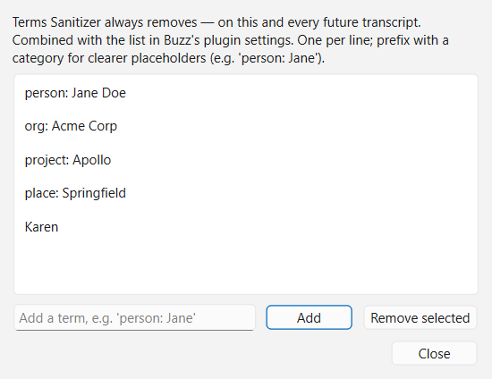
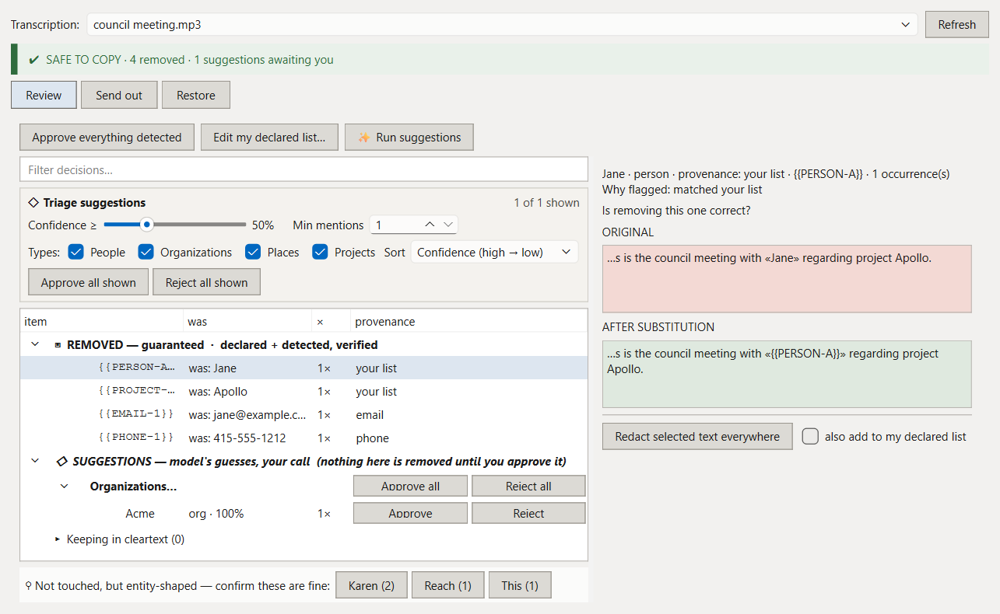
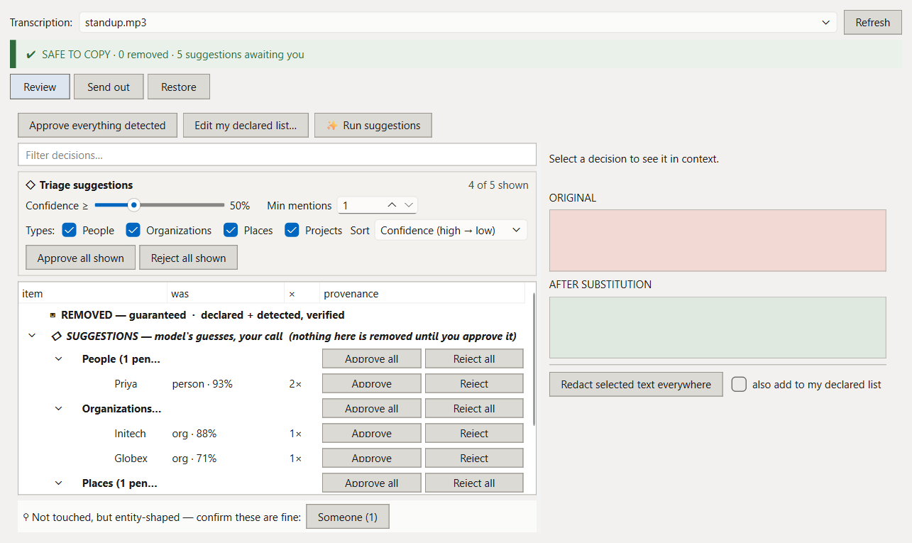
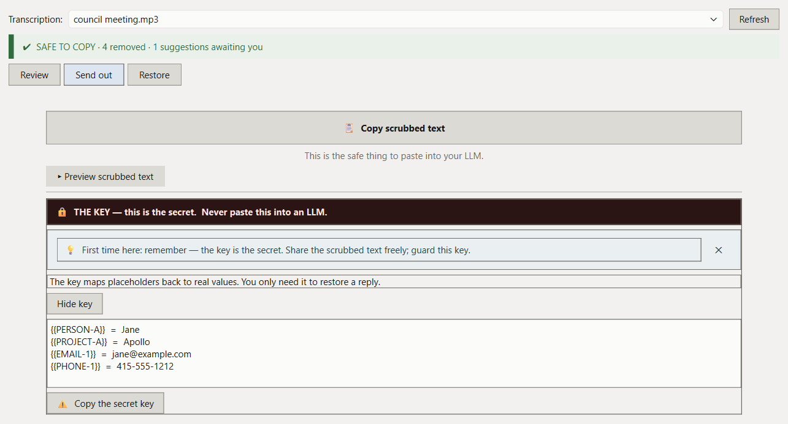
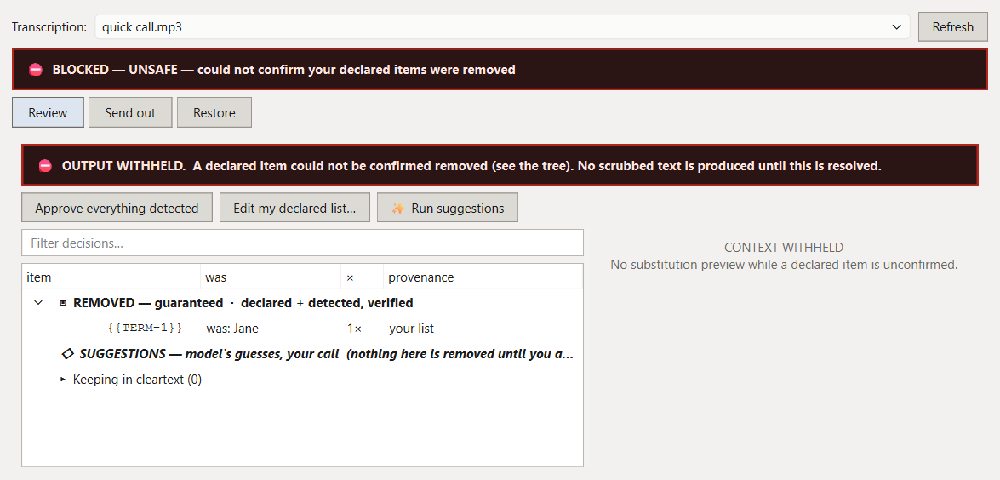
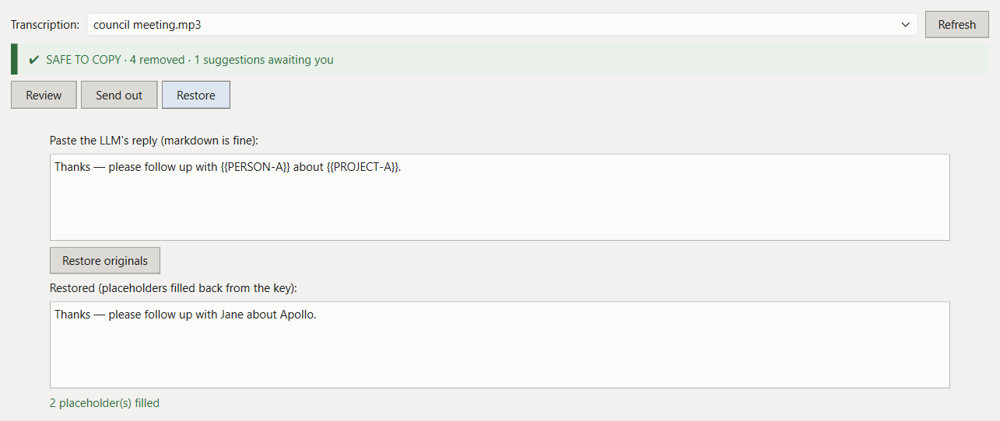

# Sanitizer

[](https://github.com/c-owen/Sanitizer/actions/workflows/ci.yml)

Sanitizer is a plugin for [Buzz](https://github.com/chidiwilliams/buzz), the open-source
transcription app. It scrubs a transcript before you paste it into a cloud LLM, replacing
names, PII, and codenames with placeholders, and puts the real values back when the reply
returns. The map from placeholder to real value is a key that never leaves your machine.

```
   Jane briefed Apollo at jane@acme.com
                │
        ┌───────▼────────┐      scrubbed text  →  safe to paste anywhere
        │    Sanitizer   │  ──────────────────────────────────────────────►
        └───────┬────────┘   {{PERSON-A}} briefed {{PROJECT-A}} at {{EMAIL-1}}
                │
             key.json  ← the secret; stays local, restores the reply
```

Detection and substitution run entirely on-device. The core path makes no network
calls and needs no extra packages; the one feature that downloads anything (the
suggestion model, below) fetches its weights once and is offline after that.

## Three layers of detection

Sanitizer finds sensitive text three ways, in decreasing order of certainty:

1. **Declared terms.** Names, projects, and codenames you list yourself. Removal is
   guaranteed: if a declared term can't be confirmed gone, Sanitizer blocks the output
   entirely rather than risk a leak.
2. **PII patterns.** Email, phone, credit card, SSN, IP address, and URL, each with its
   own on/off switch. Also guaranteed when enabled.
3. **Automatic suggestions.** A local NER model reads the transcript and proposes the
   names, organizations, and places you *didn't* think to declare. This is the safety
   net for the thing you forgot — but it only proposes. Nothing it finds is removed
   until you click approve.

The first two layers are exact and deterministic; the third is a model's guess, which
is why it's held for review instead of applied. The formal guarantee list (each one
backed by a test that fails the build) is in
[`sanitizer/README.md`](sanitizer/README.md#what-sanitizer-guarantees).

## Using it

### 1. Declare what matters

In Buzz's plugin settings, list your sensitive terms, one per line. A category prefix
gives you a readable placeholder instead of a generic `{{TERM-1}}`:

```
person: Jane Doe
org: Acme Corp
project: Apollo
place: Springfield
Karen
```

You can also add terms later from inside the review window, without retyping anything:



The six PII detectors are on by default and need no configuration:

| Type | Example | Becomes |
|---|---|---|
| Email | `jane@example.com` | `{{EMAIL-1}}` |
| Phone | `415-555-1212` | `{{PHONE-1}}` |
| Credit card | `4111 1111 1111 1111` | `{{CARD-1}}` |
| SSN | `123-45-6789` | `{{SSN-1}}` |
| IP address | `10.0.0.1` | `{{IP-1}}` |
| URL | `https://example.com/dashboard` | `{{URL-1}}` |

(The card pattern runs a Luhn checksum, so it isn't flagging every 16-digit number.)

### 2. Transcribe as usual

With the plugin enabled, each finished transcript is sanitized in the background. Your
stored transcript is never modified; Sanitizer saves its work beside it.

### 3. Review what was removed

Open **Sanitizer → Review & restore…**. Removals are grouped into three tiers:
guaranteed removals (declared terms and PII, already out), suggestions held for your
approval, and — just as important — a strip of entity-shaped words Sanitizer *left in*,
so a miss is as easy to catch as a find. Select any row to see the before/after context.



### 4. Run suggestions to catch what you forgot

Click **Run suggestions** and the local model scans the transcript for undeclared
people, organizations, and places. On a long transcript one run can flag a lot, most of
it correctly unremarkable — a public meeting is mostly public names — so the triage view
gives you a confidence slider, type filters, and sort that narrow the list live, with no
re-run. Approve individually or per group; approvals stick even if you tighten a filter
afterward, and anything you approve can be added to your declared list so future
transcripts catch it automatically.



Under the hood this is [GLiNER](https://github.com/urchade/GLiNER) (the multilingual
`gliner_multi-v2.1` weights), vendored into the plugin so it can't conflict with Buzz's
own ML stack. It runs on CPU, downloads once through Buzz's model downloader, and is
offline from then on. The feature is off by default; turn it on in settings.

### 5. Send out

One button copies the scrubbed text — that's the part that's safe to paste anywhere.
The key sits fenced off below it, clearly marked as the one thing to guard.



If a declared term can't be confirmed removed, there is no send-out: Sanitizer shows
**BLOCKED — UNSAFE** and withholds the text entirely until it's resolved.



### 6. Restore the reply

Paste the LLM's response (markdown is fine) and Sanitizer fills the real values back in
from the key, flagging any placeholder it couldn't resolve.



## Install

Grab the latest zip from [Releases](https://github.com/c-owen/Sanitizer/releases), then
in Buzz: **Help → Plugins → Add by URL**, and paste the zip's download URL
(`https://github.com/c-owen/Sanitizer/releases/latest/download/sanitizer.zip` always
points at the newest one). Restart Buzz afterward — plugin modules are cached on load.

To build from source:

```bash
git clone https://github.com/c-owen/Sanitizer.git
cd Sanitizer
python tools/package.py                 # -> dist/sanitizer.zip
cd dist && python -m http.server 8000
# In Buzz: Help -> Plugins -> Add by URL -> http://localhost:8000/sanitizer.zip -> restart
```

## What's in this repo

| Path | What it is |
|---|---|
| `sanitizer/` | The plugin — everything Buzz loads ships from here. Its own [README](sanitizer/README.md) covers the guarantees, settings, and where the sidecar files live. |
| `tools/` | Packaging and preview scripts (`package.py` builds the zip; `preview_review.py` opens the review window with sample data, no Buzz required). |
| `docs/images/` | Screenshots used above; excluded from the built zip. |
| `.github/workflows/` | CI on every push/PR; tags matching `v*` publish a release zip. |
| `buzz/` | Not tracked here. Clone [chidiwilliams/buzz](https://github.com/chidiwilliams/buzz) into it if you're running the full test suite locally. Sanitizer is a plugin for Buzz, not a fork; nothing in this repo modifies it. |

`sanitizer_core`, the detection and substitution logic, has no dependency on Buzz or Qt
(enforced by an AST check in its test suite). `sanitizer_host` is the thin adapter that
wires it into Buzz's plugin API and UI.

## Development

```bash
pip install pytest hypothesis markdown platformdirs ruff
python -m pytest sanitizer          # core suite, no Qt required
ruff check sanitizer tools          # lint
ruff format --check sanitizer tools # formatting
```

A few host-integration tests need PyQt6 and pytest-qt; without them they're skipped.
Install those too and you'll run the same set CI does.

## What it doesn't do

Sanitizer reduces disclosure risk; it isn't a compliance certification, and it won't
catch what you never declared or enabled a detector for. The honest failure mode is a
miss, which is exactly why the review window points at candidates it did *not* remove.
The full list of guarantees and non-goals is in
[`sanitizer/README.md`](sanitizer/README.md#what-sanitizer-guarantees).
