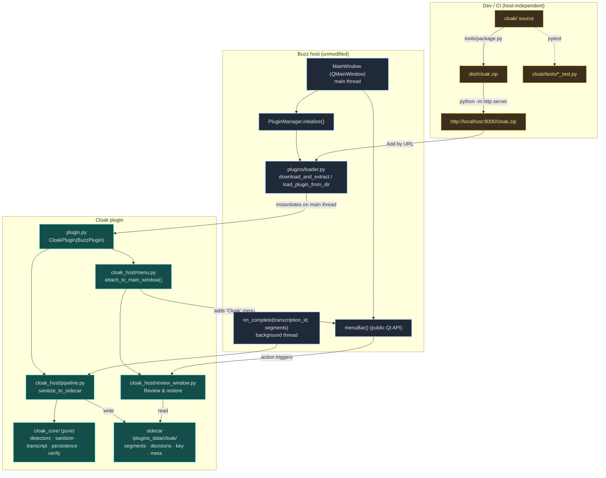

# Cloak — Developer Notes & Phase Handoff

> **Read this first if you are resuming work (e.g. after a context compaction).**
> It is the single source of truth for *where we are*, *how to build/test*, and
> *the conventions to keep*. Product brief: [`../buzz-sanitizer-spec.md`](../buzz-sanitizer-spec.md).
> Full technical plan: [`../cloak-implementation-plan.md`](../cloak-implementation-plan.md).
> UX/GUI design hand-off brief: [`../cloak-ux-design-brief.md`](../cloak-ux-design-brief.md).

---

## 1. Current status

| Phase | State | Notes |
|---|---|---|
| **0 — Walking skeleton + dev harness** | ✅ **closed** — GUI-confirmed (2026-06-30) | One menu after add + restart; suites green. |
| **1 — Core domain + declared-list** | ✅ **done** (2026-06-30) | Pure `cloak_core`; declared tier + vault + sanitize/restore. |
| **2 — Structured PII + verification gate + fail-closed** | ✅ **done** (2026-06-30) | 6 toggleable PII detectors + `VerificationGate`; PG2/3/6/7 tested. |
| **3 — Formats + markdown round-trip + placeholder robustness** | ✅ **done** (2026-06-30) | ASCII+md-safe `{{…}}` default; text/markdown handlers; FR-23 matrix; PG4. |
| **3.5 — Semantic placeholder labels** | ✅ **done** (2026-06-30) | Categorized declared terms → `{{PERSON-A}}`/`{{PROJECT-A}}` (G3); PII stays numbered. |
| **4 — Suggestion model tier (local, via Buzz downloader)** | ✅ **done** (2026-06-30) | `SUGGESTED` tier behind a `ModelProvider` port; review-gated, never auto-applied/gated. First host-coupled piece. |
| **5a — Pipeline + sidecar + review/restore window** | ✅ **done** (2026-06-30) | `on_complete` → per-segment sanitize → sidecar (PG5/PG8); config fields; sidecar-backed Review & restore window. |
| **5b — Interactive decision UX (core)** | ✅ **done** (2026-06-30) | Approve/reject + live re-derive + persist; bulk; rejected-visible; placeholder-on-approval. Lens (FR-22) + informed auto-apply (FR-12) + GUI polish deferred. |
| **UX build — Step A (v2 review restructure)** | ✅ **done** (2026-06-30) | Two-zone decision **tree** (Removed / Suggestions / Keeping-in-cleartext); loud unsafe **withholds** scrubbed (PG7 tested); key fenced + copy toast (UX-6); demo/About dropped from menu. |
| **UX build — Step B (modes + master-detail)** | ✅ **done** (2026-06-30) | Three **modes** (Review / Send out / Restore); Review is a **master-detail** split with a **side-by-side context pane** from `placements` (UX-2); restore **unresolved-tag report** (FR-7); empty-state **scan evidence** (US8). |
| **UX build — Step C (miss-catching)** | ✅ **done** (2026-06-30) | Reverse **"not touched — confirm these"** strip (heuristic candidates, UX-3/FR-22) + **select-to-redact everywhere** & add-to-list (FR-16). Pure-core `find_miss_candidates` + `build_manual_item`. |
| **UX build — Step D (teach + scale)** | ✅ **done** (2026-06-30) — on branch `step-d-polish` | First-use key teaching (US6, dismiss-once); **informed auto-apply** (FR-12, gated on ≥1 reviewed run); in-window **declared-list editing** (US2 — "add to my list" now a real cross-transcript term); tree **filter**; grayscale styling. Two new pure stores: `appstate.py`, `declared_store.py`. |
| **6 — Guarantee hardening + offline proof + DoD** | ✅ **done** (2026-06-30) — on branch `phase-6-guarantees` | **PG1–PG8** consolidated in one build-failing suite (`guarantees_test.py`), incl. the new **PG1 offline** (network primitives rigged to raise → guaranteed path still succeeds); **FR-14 extensibility** demo (new MAC detector + HTML format handler via public seams, no existing code touched); **locale-completeness** (14 files, no empty values); user-facing **README** (guarantees + limits + "key is the secret", NG2). |
| **Suggestions — on-demand button** | ✅ **done** (2026-07-01) — CONFIRMED in real Buzz | "✨ Run suggestions" button; vendored GLiNER (`_vendor`, no pip); worker thread + windowed inference; base-backbone offline-load fix (§6). Surfaced the ~222-item problem. |
| **Step E — run-once, triage-interactively** | ✅ **done — v0.7.1 release** (2026-07-01) | The ~222 answer: keep GLiNER's **confidence** on each item; a live **triage panel** (confidence slider + live count + type toggles + min-mentions + sort) filtering the computed set client-side (no re-run); **non-linear** review — SUGGESTIONS grouped by type with per-type + shown-wide **bulk** approve/reject, multi-select + Ctrl+Return/Ctrl+Backspace. `cloak_core` stays pure. Shipped after a 4-track repo audit (security/packaging/correctness/docs) — fixes below. |

**Current state at a glance:** `cloak_core` **v0.7.1** · **252 tests pass** on system
Python, **311** in `.venv-qt` (PyQt6 + hypothesis + markdown) · `ruff` clean.
The **~222-suggestions problem is solved** and shipped in **v0.7.1**: one model run,
then an interactive **triage** surface — GLiNER's confidence is kept per item; a **live
control panel** (confidence slider + "N of M shown" count + person/org/place/project
toggles + min-mentions + sort) filters the computed set **client-side with no re-run**;
the SUGGESTIONS zone is **grouped by type** with per-type and shown-wide **bulk**
approve/reject, multi-select and Ctrl+Return / Ctrl+Backspace. A pre-release **4-track
audit** (security · packaging · correctness · docs) landed fixes: a mid-scan
transcript-switch guard, approved-suggestions stay visible under a toggled-off type, an
honest spine caution when a declared/PII item is kept in cleartext, and the vendored
GLiNER **localhost HTTP server (`serve/`) pruned from the zip**. See §8 for what remains.
**Phases 0–6 + the full v2 UX (A–D) are done** — every product guarantee (PG1–PG8) is
now backed by a build-failing test (`cloak/cloak_core/tests/guarantees_test.py`,
including the offline PG1), FR-14 extensibility is demonstrated, locale files are
completeness-checked, and there's a user-facing `cloak/README.md`. **Suggestions are now
on-demand and CONFIRMED WORKING in real Buzz (2026-07-01):** a **"✨ Run suggestions"
button** in the review window scans the loaded transcript with the vendored GLiNER model
on a **worker thread** (windowed inference, download-on-first-use, failures shown — never
a false "found nothing"); results land as PENDING rows to approve/reject. GLiNER is
**vendored** (`cloak/_vendor`), so no pip. **Open problem → next work:** on a real
1450-segment council meeting it flagged **~222 entities** — NER finds every named entity,
but "named entity" ≠ "sensitive". The agreed fix is a **run-once-then-triage** surface
(user-exposed confidence slider + type toggles + grouped bulk actions, filtering the
computed set live). Design + plan in **§8**.
The **v2 UX (Steps A–D) is complete** (docs under `design/`; task brief
`cloak-implementation-brief-for-claude-code.md`). One window, **three modes** (Review /
Send out / Restore) under a persistent **safety spine** (verdict in word+glyph, UX-5).
Review is the home surface — a two-zone **decision tree** (▣ REMOVED · ◇ SUGGESTIONS
Approve/Reject · ▸ Keeping-in-cleartext) in a **master-detail** split with a
**side-by-side context pane** (ORIGINAL vs AFTER, from `placements`), a **filter** box for
scale, and **miss-catching** below the tree (heuristic candidates + select-to-redact,
UX-3/FR-16/FR-22). Send out = one Copy + fenced key with a one-time **"key is the secret"
note** (US6); Restore = mirror + **unresolved-tag report**; empty = **scan evidence**.
**Step D** added the teach-and-scale polish: **informed auto-apply** (FR-12, offered only
after ≥1 reviewed run), **in-window declared-list editing** (US2 — "add to my list" is now
a real cross-transcript term), the filter, and grayscale styling — backed by two new
**pure** stores (`cloak_core/appstate.py` prefs, `cloak_core/declared_store.py` list; both
host-path-injected). **Unsafe withholds** the scrubbed text from every copy path in every
mode (PG7, tested). `cloak_core` stays pure. Next: **Phase 6** (lock PG1–PG8 in CI).

**What Phase 0 delivered & verified:**
- A loadable `BuzzPlugin` (`id="cloak"`, `version="0.0.0"`, no pip deps).
- The packaging tool produces `dist/cloak.zip` (`plugin.py` at the archive root).
- Buzz's **real loader** loads the plugin, and the **full `file://` ingest path**
  (`download_and_extract` → safe-extract → validate → install → re-load) works.
- The plugin loads cleanly **headless** (no PyQt6): the UI-attach is swallowed and logged.
- **Menu attach validated in real PyQt6** (offscreen venv): defers off `__init__`,
  collapses double-instantiation to one menu, and marshals the worker-thread
  add-from-URL path to the main thread. See the threading fix in §6.
- `ruff` + `ruff format` clean. Suites: system-Python `7 passed, 1 skipped`;
  PyQt6 venv `menu_test.py` `8 passed`.

**Confirmed in a real Buzz GUI (Phase 0 closed):** Add-by-URL shows a single
**Cloak** menu (no duplicate), "Hello from Cloak…" opens its window, and the
menu persists as a single entry after restart.

**What Phase 1 delivered (`cloak_core`, pure Python — no buzz/Qt):**
- Domain model (`model.py`): `Span`, `Detection`, `Decision`, `Key`,
  `SanitizationResult`, `TrustTier`, `DecisionState`.
- `DeclaredListDetector` (FR-1): word-boundary-safe ("Jane" ≠ "Janet"), case /
  possessive / flexible-whitespace variants, longest-term-wins.
- `Vault` + placeholder scheme (FR-3/PG4): consistent, injective, reversible
  placeholders (then `TERM-1`; **now `{{TERM-1}}`** — default changed in Phase 3);
  a shared vault keeps them consistent across texts.
- `sanitize()` (declared tier auto-approved; tier-agnostic overlap resolution
  seam for Phase 2/4) and `restore()` (FR-7: skips unmatched placeholders).
- **Guarantee enforced in CI:** `boundary_test.py` AST-scans `cloak_core` and
  fails if it ever imports `buzz`/`PyQt6` (the "verifiable independently" mandate).
- Tests run on the **system Python** (no Qt): `python -m pytest cloak/cloak_core/tests`
  → `43 passed`; property tests (`hypothesis`) add 2 more where installed.
- **In-Buzz demo** (`cloak_host/demo_window.py`): the Cloak menu gained a
  **"Sanitizer (Phase 1 demo)…"** action — a playground that runs `cloak_core`
  inside the real app (paste terms + text → scrubbed + key + restore). It also
  proves `cloak_core` imports/runs inside Buzz ahead of Phase 5. CLI twin:
  `tools/demo_core.py`.
- **Deferred to Phase 5 (don't forget):** Phase 1 operates on a single `str`. The
  segment-aware loop (one shared `Vault` across segments, preserving each
  segment's timing → PG5) is wired when we reach host integration. The seam
  exists: pass a shared `vault` to `sanitize()` per segment.

**What Phase 2 delivered (`cloak_core`, still pure):**
- `detectors/pii.py` — six **individually toggleable** detectors behind the same
  `Detector` seam: `email`, `phone`, `credit_card` (Luhn-validated), `ssn`,
  `ip` (octet-validated IPv4), `url` (trailing-punctuation trimmed). `pii_detectors(enabled)`
  builds the enabled set; disabled types are never touched (FR-2). Each documents
  its recall/precision posture; detection leans to recall (R1).
- `verify.py` — `VerificationGate.verify(text, ignore=…)` re-scans the output and
  fails closed (`clean=False` + `survivors`) if any **guaranteed** item (declared
  or enabled PII) leaked (FR-6, PG7). Suggestions are *not* gated. Placeholders are
  masked (equal-length) before scanning so a term inside a label isn't a false hit.
- `sanitize()` now auto-approves declared **and** PII (only `SUGGESTED` is PENDING),
  resolves overlaps **longest-span-first** (a name inside an email → the email wins,
  no `@domain` fragment leak), and runs the gate → `result.clean` / `result.survivors`.
- Guarantee tests: PG2/PG3 (no survivor), PG6 (determinism with PII), PG7 (inject a
  recall miss → fails closed). 100 core tests pass on system Python.
- Two bugs the guarantee tests caught (now fixed): PII was created but not substituted
  (only declared was auto-approved); and the greedy card regex bridged an adjacent SSN
  (now matches consistent 4-groups or contiguous digits).

**What Phase 3 delivered (`cloak_core`, still pure):**
- **Placeholder robustness (FR-23) — the headline.** Default scheme switched from
  `…` to **`{{LABEL-N}}`** (`BraceScheme`), which is both **ASCII-safe** (survives
  legacy/cp1252 copy-paste — also fixes the demo's console issue and very likely the
  first-run crash) and **markdown-safe** (no markdown-active chars; `{{ }}` has no
  markdown meaning, unlike `[[ ]]`→wiki-link or `<x>`→HTML). `placeholders.py` adds
  `is_ascii_safe` / `is_markdown_safe`; `BracketScheme` (``) stays available behind
  the swappable `PlaceholderScheme` (FR-14, OQ6). **If you prefer the `` look, it's
  a one-line `DEFAULT_SCHEME` change — flag it.**
- `formats/` — `FormatHandler` protocol + `TextHandler` + `MarkdownHandler`, both
  directions (FR-24); `format_handler(name)` / `FORMATS`. v1 handlers are honest
  pass-throughs (a transcript is valid markdown; tokens are md-safe; restore is
  substring-based so md wrapping *around* a token is fine) — the seam is for P2
  formats (SRT/VTT).
- Robustness matrix (`placeholder_robustness_test.py`): token is ASCII + md-safe,
  unchanged by Unicode normalization, and restore survives bold/italic/code/list/quote
  wrapping, adjacent punctuation, and a **real markdown render** (`markdown` lib,
  importorskip). Markdown round trip (PG4): bold a placeholder in the "reply" →
  restore still reconstructs.
- Demo upgraded: now has a **"Returned text → Restore"** box, so you can copy the
  scrubbed text out, format it (e.g. bold a token) elsewhere, paste it back, and watch
  restore reconstruct it. `tools/demo_core.py` shows the same via `--text`.

**What Phase 3.5 delivered (semantic placeholder labels — `cloak_core`, pure):**
- `categories.py`: `person/org/project/place` → labels `PERSON/ORG/PROJECT/PLACE`;
  `ENTITY_LABELS` (those four) render with **letters** (`{{PERSON-A}}`), everything
  else **numbers** (`{{EMAIL-1}}`, `{{TERM-1}}`). The motivation: an LLM reasons over
  "PERSON-A told PERSON-B about PROJECT-A" far better than "TERM-1 told TERM-2 …" (G3,
  brief glossary). `_to_letters` is bijective base-26 (A…Z, AA…).
- `DeclaredListDetector` now accepts **`dict[category, list[str]]`** (categorized) *or*
  a bare `list[str]` (uncategorized → generic `{{TERM-1}}`, **unchanged** — so no
  existing test churned). Each detection's `label`/`type` reflect its category.
- Phase 4 alignment: the suggestion model emits person/org/location → these labels are
  ready, so suggestions will surface as `{{PERSON-?}}` too.
- Demos take `category: term` lines / `--terms "person:Jane,project:Apollo"`. Default
  sample now shows `{{PERSON-A}}` / `{{PROJECT-A}}`.

**What Phase 4 delivered (suggestion model tier — FR-9/FR-13/FR-15):**
- `cloak_core/detectors/suggest.py` (still pure): a `ModelProvider` **port**
  (Protocol) + `RawEntity` (provider output) + `ModelSuggestionDetector`. The
  detector turns model entities into **`SUGGESTED`-tier** detections — categorized
  (`person/org/place/project` → `PERSON/ORG/PLACE/PROJECT`), substring-safe
  (`value == text[span]`, edge whitespace trimmed), with a human-readable reason.
  It owns the zero-shot **labels** + confidence **threshold**; the provider only
  runs a model. **Degrades gracefully:** if the provider raises (model absent), it
  logs and returns `[]`, so the guaranteed path is unaffected.
- **Sanitizer wiring (the two real integration points):**
  1. **Suggestions are held, never applied.** A `SUGGESTED` decision is `PENDING`,
     **not** spliced into the scrubbed text, and gets **no placeholder/key entry**
     here — so the key stays exactly the set of applied substitutions. Its
     placeholder is allocated on **approval** (Phase 5). (`Decision.placeholder == ""`
     for pending items.)
  2. **Excluded from the fail-closed gate.** `sanitize` re-checks only the
     guaranteed detectors (a detector advertising class attr `tier == SUGGESTED` is
     filtered out), so a suggested name left in cleartext does **not** make
     `clean=False`, and the model isn't re-run during verification (PG6).
  - Also made grouping **tier-aware**: if the same value is both declared/PII *and*
    suggested, the **guaranteed tier wins** (auto-approved, removed everywhere). With
    a single tier this is a no-op (overlap resolution already handles same-span hits);
    it's an explicit invariant + future-proofing.
- **Host adapter** `cloak_host/model_provider_buzz.py` (`BuzzGlinerProvider`): the
  first host-coupled piece. Implements the port over **GLiNER** (`urchade/gliner_small-v2.1`,
  swappable), CPU. **All heavy imports are lazy** (`gliner`/`buzz`/`huggingface_hub`
  inside methods) so the module loads anywhere. Model is **fetched on first use via
  Buzz's `download_from_huggingface`** into the shared cache (`~/.cache/Buzz/models`),
  **nothing bundled**, reused offline (`local_files_only`) thereafter (FR-13).
- **Tests:** `cloak_core/tests/suggest_test.py` (stub provider — tier/PENDING/not-in-key,
  gate-exclusion, label→category mapping, substring safety, threshold, graceful
  degradation, cross-tier dominance). `tests/model_provider_buzz_test.py` (module
  imports with no ML/buzz; port shape; load-failure propagation + detector swallow;
  **opt-in real-model run** gated on `CLOAK_RUN_MODEL_TEST=1`). New public API exported
  from `cloak_core`: `ModelProvider`, `ModelSuggestionDetector`, `RawEntity`,
  `DEFAULT_LABELS`. `cloak_core` is **still buzz/Qt-free** (`boundary_test` green).
- **In-app status:** there's no review surface yet (that's Phase 5), so PENDING
  suggestions aren't *visible* in the demo window (it only applies APPROVED items).
  The **CLI demo shows the tier**: `python tools/demo_core.py --suggest` flags
  undeclared capitalized words as `[pending]` (a crude offline stand-in for the model,
  ships nowhere) — held, left in cleartext, absent from the key, `clean` still True.

**What Phase 5a delivered (host integration: pipeline + sidecar + review — FR-5/8/13, PG5/PG8):**
- **Transcript pipeline (`cloak_core/transcript.py`, pure).** `sanitize_transcript`
  runs `sanitize` over **each segment** with one **shared `Vault`** → placeholders
  consistent across the whole transcript, each segment's `start`/`end` preserved
  (PG5). Per-segment decisions merge into transcript-level **`ReviewItem`s** (one per
  distinct value, with every `Placement` = segment + span). `clean` is the AND across
  segments. `apply_review(originals, items)` re-derives scrubbed + key from current
  item states (the inverse used when the user edits decisions in 5b). Plus JSON
  (de)serialization helpers.
- **Sidecar persistence (`cloak_core/persistence.py`, pure, path injected).** Writes
  four files per transcription — `segments.json` (original + scrubbed, timing),
  `decisions.json` (the review items), `key.json` (**the secret, separate file —
  PG8**), `meta.json` (written **last** → its presence marks a complete sidecar).
  `read_sidecar` / `has_sidecar` / `list_sidecars` (newest-first).
- **Host pipeline (`cloak_host/pipeline.py`).** `on_complete` calls `sanitize_to_sidecar`:
  builds detectors from config (declared terms + per-type PII toggles + opt-in
  suggestions), runs the core, writes the sidecar under
  `cloak_host/paths.py::sidecar_dir(id)` (`<Buzz cache>/plugins_data/cloak/<id>`).
  **Default config = guaranteed path only** (declared + PII), fully offline. The
  **stored transcript is never modified** — `on_complete` returns `None` and only
  writes the sidecar (PG5). Failures are contained (never break the host).
- **Config fields** on the plugin: `declared_terms` (textarea), six `pii_*` bools
  (default on), `enable_suggestions` (default off). Plugin **version → 0.5.0**.
- **Review & restore window (`cloak_host/review_window.py`)** — replaces the demo for
  real use. Reads sidecars, picks the newest (dropdown to switch), shows the summary
  ("Removed N · M pending · clean/UNSAFE"), the **scrubbed transcript** with a
  prominent **Copy scrubbed** (disabled when not clean — PG7 at the UI), the
  **decisions** table (placeholder/original/type/why/count/state, words not color —
  UX-5), the **key hidden** behind a Reveal toggle (the secret — UX-6/7), and a
  paste-back **Restore** box. Menu shows **"Review & restore…"** only; the manual demo
  is dev-gated behind the `CLOAK_DEV` env var (Step A), and the "About" action was dropped.
- **Tests (+38):** `transcript_test`, `persistence_test` (pure core); `pipeline_test`
  (detectors-from-config, **segments not mutated**, PII toggle, `on_complete` via
  Buzz's real loader → writes sidecar without touching segments, never raises);
  `review_window_test` (qtbot — loads newest, copy, reveal key, restore incl.
  markdown, empty state). `cloak_core` still buzz/Qt-free (`boundary_test` green).

**What Phase 5b delivered (interactive decision list — UX-1/2/4/5/9):**
- The decisions table is now **editable**: a *Remove* checkbox per row. Tick → APPROVE,
  untick → REJECT (kept in cleartext). Every toggle calls
  `cloak_core.apply_review(segments, items)` to **re-derive** the scrubbed text + key
  live, refreshes the panes, and **persists** the edit back to the sidecar
  (`write_sidecar` accepts the loaded `Sidecar`; `meta` counts updated). Reopening
  reflects the user's decisions.
- **Placeholder-on-approval:** approving a PENDING suggestion allocates a fresh,
  non-colliding token via `cloak_core.next_free_placeholder(existing, label, scheme)`;
  already-assigned placeholders stay **stable** (a rejected item keeps its placeholder
  so re-approve reuses it).
- **Bulk + rejected-visible:** "Approve all suggestions" / "Reset to recommended"
  (declared+PII→approved, suggestions→pending); rejected items **stay as rows** (state
  in words — UX-5) and re-approve with one tick (UX-9).
- **Tests (+6):** `next_free_placeholder` (letters vs numbers, skip used); review-window
  approve-suggestion-persists-and-reopens, reject-declared-keeps-cleartext, bulk, reset.
- **Deferred (documented):** suspicion lens (FR-22, lowest priority), informed
  auto-apply (FR-12, needs a persistent "reviewed" flag + pipeline wiring), a richer
  side-by-side detail view (UX-2) and GUI styling. See §8.

---

## 2. Repository layout

```
buzz-plugin/
├── buzz/                     # the host app (NEVER modified by Cloak)
├── cloak/                    # the distributable plugin (zipped as cloak.zip)
│   ├── plugin.py             # BuzzPlugin entry point + sys.path bootstrap + UI attach
│   ├── cloak_core/           # HOST-INDEPENDENT core (no buzz/no Qt)
│   │   ├── model.py          # Span/Detection/Decision/Key/SanitizationResult/tiers
│   │   ├── categories.py     # person/org/project/place → PERSON/ORG/… labels (lettered)
│   │   ├── detectors/        # base.py + declared.py (FR-1) + pii.py (FR-2) + suggest.py (FR-15)
│   │   ├── formats/          # FormatHandler + text.py + markdown.py (FR-24)
│   │   ├── placeholders.py   # PlaceholderScheme; default BraceScheme ({{TERM-1}}), FR-23
│   │   ├── vault.py          # consistent ↔ reversible placeholder/key allocation
│   │   ├── sanitizer.py      # detect → decide → substitute → verify (single text)
│   │   ├── transcript.py     # per-segment sanitize + merged ReviewItems (PG5); apply_review
│   │   ├── persistence.py    # sidecar read/write (pure fs; path injected) (PG8)
│   │   ├── appstate.py       # cross-transcript prefs (has_reviewed/auto-apply/teaching)
│   │   ├── declared_store.py # growable in-window declared list (US2; unioned in pipeline)
│   │   ├── verify.py         # VerificationGate — fail-closed re-check (FR-6/PG7)
│   │   ├── restore.py        # reverse from the key (skips unmatched)
│   │   └── tests/            # pure-core suite (no buzz/Qt; runs on system Python)
│   ├── cloak_host/           # Buzz/Qt adapters (may import PyQt6 + buzz)
│   │   ├── i18n.py           # shared translator -> plugin root's locale/
│   │   ├── menu.py           # main-thread menu attach (Review; demo gated by CLOAK_DEV)
│   │   ├── paths.py          # sidecar dir under Buzz's cache (platformdirs)
│   │   ├── pipeline.py       # on_complete glue: config → detectors → sidecar
│   │   ├── review_window.py  # interactive Review & restore window (Phase 5a+5b)
│   │   ├── demo_window.py    # Phase 1 in-Buzz sanitizer playground (manual demo)
│   │   └── model_provider_buzz.py  # GLiNER ModelProvider; model fetched via Buzz (FR-13)
│   ├── _vendor/              # bundled third-party (GLiNER) — on sys.path at runtime, no pip
│   │   ├── gliner/           # GLiNER 0.2.27, pure-Python wheel unpacked verbatim
│   │   ├── LICENSE           # Apache-2.0 (attribution)
│   │   └── README.md         # what's vendored + why + how to update
│   ├── locale/               # 14 bundled-locale JSON files (currently empty maps)
│   ├── tests/                # host-integration tests (*_test.py)
│   ├── pyproject.toml         # ruff config ONLY (dev-only; excluded from the zip)
│   └── DEV_NOTES.md          # this file
├── tools/
│   ├── package.py            # folder -> dist/cloak.zip
│   └── demo_core.py          # CLI demo of cloak_core sanitize/restore (no Buzz/Qt)
└── dist/
    └── cloak.zip             # build output
```

---

## 3. The dynamic test loop (build → serve → ingest)

This is the user-requested workflow and the canonical way to test in the real app.

```bash
# 1) build the zip
python tools/package.py                       # -> dist/cloak.zip

# 2) serve it locally
cd dist && python -m http.server 8000

# 3) ingest in Buzz:  Help → Plugins → Add by URL → http://localhost:8000/cloak.zip
#    (Buzz downloads, validates, installs to ~/.cache/Buzz/plugins/cloak, auto-enables)
```

`PluginManager.add_from_url` uses `urlopen`, so `file://` also works:
`file:///<abs>/dist/cloak.zip`.

**Fast inner loop** (skip the zip while iterating): copy the folder straight in and
restart Buzz:
```bash
cp -r cloak/. ~/.cache/Buzz/plugins/cloak/        # Windows: %LOCALAPPDATA%\Buzz\plugins\cloak
```

**Updating an installed Cloak requires restarting Buzz** — see the gotcha in §6.

---

## 4. How to run the tests

Two suites, two environments — together they cover everything. Run from the repo root.

- **`cloak/cloak_core/tests`** — the pure core (no buzz/Qt). Runs on plain **system
  Python**: `python -m pytest cloak/cloak_core/tests`.
- **`cloak/tests`** — host-integration: `packaging_test`, `plugin_load_test` (light
  `buzz.plugins.loader`), `menu_test` + `demo_window_test` (need PyQt6 + pytest-qt).

| Environment | Command (from repo root) | Result | What skips |
|---|---|---|---|
| **System Python** (3.14 here) | `python -m pytest cloak` | ~252 pass | menu/demo (no PyQt6), property (no hypothesis), md-render (no markdown) |
| **`.venv-qt`** (3.12 + PyQt6 + hypothesis + markdown) | `QT_QPA_PLATFORM=offscreen .venv-qt/Scripts/python.exe -m pytest cloak` | ~311 pass | plugin_load (no platformdirs/buzz) |

**`.venv-qt` already exists** in the tree (throwaway — not committed, not zipped, lets us
run the Qt/hypothesis/markdown tests without the heavy Buzz env). Recreate if needed:
```bash
uv venv .venv-qt --python 3.12
uv pip install --python .venv-qt/Scripts/python.exe pyqt6 pytest pytest-qt hypothesis markdown
```
In the **full Buzz env** (PyQt6 present): `cd buzz && uv run python -m pytest ../cloak`.
Conftests put the plugin root (+ `buzz` root) on `sys.path`, so cwd doesn't matter.
Lint everything: `uvx ruff check cloak tools` and `uvx ruff format cloak tools`.

---

## 5. Coding conventions (keep these consistent across all phases)

- **Format & lint:** `ruff` + `ruff-format`, line length **88**, double quotes
  (config in `cloak/pyproject.toml`, matching the Buzz host).
  Run: `uvx ruff check cloak tools` and `uvx ruff format cloak tools`.
- **Python:** target **3.12** (Buzz's runtime). Put `from __future__ import annotations`
  at the top of every module; use modern typing (`X | None`, not `Optional[X]`).
- **Docstrings:** PEP 257. Module + public class/function docstrings required. For
  `cloak_core` interfaces, state **Assumes:** and **Guarantees:** explicitly — the
  brief's "verifiable by contract" mandate (§5).
- **Naming:** `snake_case` functions/modules, `PascalCase` classes, `UPPER_CASE`
  constants, `_leading_underscore` for internals.
- **Imports:** grouped stdlib / third-party / local (ruff `I`). **Lazy-import** heavy or
  optional deps (PyQt6, ML models) *inside* the function that needs them, so headless
  contexts and the offline guaranteed path never pay for them.
- **Logging:** `logger = logging.getLogger(__name__)`; never `print` in library code
  (CLI scripts may print with `# noqa: T201`).
- **Errors:** raise/catch specific exceptions. Broad `except Exception` only at
  isolation boundaries (plugin load, hook edges) — annotate `# noqa: BLE001` and log.
- **Layering (hard rule, will be test-enforced from Phase 1):** `cloak_core` MUST NOT
  import `buzz` or `PyQt6`. All host coupling lives in `cloak_host`.
- **Tests:** pytest; files `*_test.py`, functions `test_*`; `pytest.importorskip` for
  optional deps; **no network in core tests** (PG1). Prefer `hypothesis` for
  substring-safety / round-trip properties (test-only dep, never shipped).
- **i18n:** wrap user-facing strings in `_()`; `locale/*.json` keys must equal the
  English source string exactly; **never** use empty-string values (blanks the UI).

---

## 6. Key decisions & gotchas (the non-obvious stuff)

- **Import bootstrap.** Buzz execs `plugin.py` as a standalone module by path, so
  relative imports don't resolve. `plugin.py` inserts the plugin root on `sys.path`;
  intra-plugin imports are therefore **flat top-level** (`import cloak_core`,
  `from cloak_host.menu import …`). The `# noqa: E402` on the `buzz` import in
  `plugin.py` is intentional — it must follow the `sys.path` insert.
- **Update caveat (restart required).** `cloak_core`/`cloak_host` get cached in
  `sys.modules`. Re-ingesting replaces files on disk but **not** the loaded modules, so
  **restart Buzz** to pick up code changes.
- **Headless rule is thread-affinity, not a UI ban.** Buzz's contract says hooks
  "must never touch Qt widgets" — that's because hooks run **off** the main thread.
  Cloak attaches UI from `plugin.__init__`, which runs **on** the main thread during
  `PluginManager.initialize`, so it's compliant. (`base.py` states this; `AGENTS.md`
  does not contain a blanket ban.)
- **Menu attach must be marshaled to the main thread (the real bug we hit).** Buzz
  constructs the plugin on *two different threads at two different times*, so a
  synchronous attach in `__init__` fails both ways:
  - **Startup** — `MainWindow.__init__` calls `PluginManager.initialize()` (~L80)
    *before* `setMenuBar()` (~L128). Attaching there lands on a default menu bar Buzz
    then **discards** → no menu after restart.
  - **Add from URL** — `PluginManager.add_from_url` runs on a `QThreadPool` worker
    thread *and* instantiates the plugin **twice** (`download_and_extract` validates by
    loading, then `load_plugin_from_dir` loads again). Cross-thread `QMenu` parenting
    breaks the `findChild` dedupe → **two menus**.
  - **Fix (ours only, no Buzz change):** `attach_to_main_window` posts the work onto the
    **main thread's event loop** via a `_MainThreadInvoker` (queued signal; moved to the
    app thread). It runs *after* the window is built (fixes startup) and *on* the GUI
    thread (fixes the duplicate); `build_cloak_menu` stays idempotent. Covered by
    `test_attach_defers_then_attaches`, `test_repeated_attach_yields_single_menu`,
    `test_attach_from_worker_thread_attaches_on_main`.
  - This is the §2.3 risk made concrete: Buzz has **no UI-extension hook**, so menu
    injection inherently rides host-internal construction order/threads. We made it
    robust; the clean long-term answer is an upstream `setup_ui(main_window)` hook (a
    Buzz change, hence out of scope here).
- **Hold window references.** Top-level `QWidget`s are GC'd the moment the opener
  returns unless retained — `menu._open_windows` keeps them alive.
- **Locale path.** `cloak_host/i18n.py` points `plugin_gettext` at the **plugin root**
  (`plugin.py`'s dir), not `cloak_host/`, so it finds `cloak/locale/`.
- **Placeholder charset (RESOLVED in Phase 3).** The default is now the ASCII +
  markdown-safe `{{LABEL-N}}` (`BraceScheme`), so the cp1252 copy-paste/console risk is
  gone. `` (`BracketScheme`) is still available but non-ASCII; only use it with a
  guaranteed UTF-8 sink. Robustness is enforced by `placeholder_robustness_test.py`.
- **Suggestion tier is held, not applied (Phase 4).** `ModelSuggestionDetector` emits
  `SUGGESTED`/`PENDING` items only. In `sanitize` a PENDING item is **not** substituted,
  has **no placeholder and no key entry** (the key = exactly the applied substitutions),
  and is **excluded from the fail-closed gate** (a detector with class attr
  `tier == SUGGESTED` is filtered out, so suggestions can't make `clean=False` and the
  model isn't re-run during verification). **Phase 5 allocates the placeholder on
  approval.** The model never touches the guaranteed path: if the provider raises, the
  detector logs and returns `[]`. The host adapter (`model_provider_buzz.py`) lazy-imports
  everything heavy and fetches the model via Buzz's downloader on first use (FR-13) — only
  exercised by the opt-in test (`CLOAK_RUN_MODEL_TEST=1`).
- **GLiNER is vendored, not pip-installed (decision, 2026-07-01).** `gliner` is a small
  **pure-Python** wheel and **all its runtime deps are already in Buzz** (`torch`,
  `transformers`, `huggingface_hub`, `tqdm`, `onnxruntime`, `sentencepiece` — verified in
  Buzz's `uv.lock`). So we bundle the ~1 MB of GLiNER code in **`cloak/_vendor/gliner/`**
  (unpacked `gliner-0.2.27-py3-none-any.whl`, Apache-2.0) and put `cloak/_vendor` on
  `sys.path` via `model_provider_buzz._ensure_vendor_on_path()` before `import gliner`.
  Result: suggestions work in **every** Buzz deployment (frozen `.exe`, Snap, Flatpak,
  source) with **no pip install** — only the model *weights* download, on demand, via
  Buzz's HF downloader. **Rejected: `pip_dependencies=["gliner"]`** — Buzz installs deps
  with `pip install --target <dir>` and **no `--no-deps`**, so it would re-pull torch
  (GB) into the plugin dir and could shadow/break Buzz's own CUDA torch. Default model is
  now the multilingual `urchade/gliner_multi-v2.1`. To update GLiNER: replace
  `cloak/_vendor/gliner/` from the new wheel (see `cloak/_vendor/README.md`). `_vendor` is
  excluded from ruff; the packager auto-includes it in the zip.
- **GLiNER offline load needs the BASE backbone's tokenizer + config (2026-07-01 fix).**
  `gliner_multi-v2.1`'s HF repo ships **only** `gliner_config.json` + weights — **no
  tokenizer**. Its config's `model_name` points at `microsoft/mdeberta-v3-base`, and
  gliner loads the tokenizer (`AutoTokenizer`) and encoder config (`AutoConfig`,
  `_vendor/gliner/modeling/encoder.py:88`) from **that** repo. So a first run that only
  fetched the gliner repo fails at load with *"couldn't connect to huggingface.co …
  couldn't find in cache"*. Fix in `model_provider_buzz.py`: `_ensure_downloaded` reads
  `model_name` from `gliner_config.json` and **also fetches the base backbone's tokenizer
  + config** (via Buzz's downloader, `_BASE_PATTERNS`) — but **not** its weights (gliner
  ships its own fine-tuned encoder; `from_pretrained=False` → `from_config`). `_load_model`
  loads the gliner files from the **local snapshot dir** (`Path(model_id).exists()` → no
  hub) and threads `cache_dir=model_root_dir` + `local_files_only` so the base resolves
  from Buzz's cache. Verified the base download fetches exactly `config.json` +
  `tokenizer_config.json` + `spm.model` (~4 MB), no weights.
- **Suggestion triage is a *live view*, not an edit (Step E).** The confidence slider /
  type toggles / min-mentions / sort **filter the already-computed suggestion set** —
  they never re-run the model and never touch the sidecar. The model is asked **once**
  at a low floor (`_SUGGESTION_FLOOR = 0.3`, matching the provider floor) so every
  candidate is in hand; the slider default sits at `0.5`, so the *default* view still
  matches the pre-triage behaviour and lowering it reveals the 0.3–0.5 band. Only
  changing *which labels* the model searches would need a re-run. GLiNER's confidence
  now rides on `ReviewItem.score` (max across windows; 1.0 for guaranteed items) and
  round-trips through the sidecar. Bulk actions (`_approve_items`/`_reject_items`) do
  **one** re-derive/persist for the whole batch (and still count as a review → FR-12).
- **Qt `setItemWidget` cleanup is deferred — hide before rebuild (Step E gotcha).**
  `QTreeWidget.removeItemWidget` (and `setItemWidget(None)`) only **`deleteLater()`** the
  old widget, so rebuilding a subtree that has per-row button widgets (the suggestion
  Approve/Reject pairs) on every slider tick leaves stale button pairs **painting for a
  frame** before they're freed — visible phantom rows during a drag. `_clear_suggestion_children`
  therefore **`hide()`s each item-widget synchronously** before removing it. (Verified
  with an offscreen `grab()`: 40 live button objects mid-rebuild, but none paint.) The
  full-rebuild path (`_tree.clear()`) doesn't hit this; only the targeted, selection-
  preserving suggestion re-render does.
- **KNOWN ISSUE — demo crashed Buzz on the *first* open, worked on the second.** Likely
  PyQt6's default of aborting the process on an unhandled exception inside a slot,
  triggered by a one-time first-run hiccup (lazy `cloak_core` import, or first-render
  font fallback). **Update (Phase 3.5):** it still happens with ASCII `{{…}}` tokens, so
  it is **NOT** font fallback — it's the **add-from-URL load path** (background thread +
  double-instantiate + first lazy `cloak_core` import). `_safe_open` now turns it into a
  **silent first-run no-op** (no crash); a **Buzz restart fixes it** (clean main-thread
  load). The traceback is already logged by `_safe_open` (`logger.exception`). **To debug
  later:** grab that log line on a fresh install. Low priority (non-crashing, restart-fixable).
- **DEFERRED — GUI layout / view pass.** The demo + review windows are functional but
  unstyled; a proper layout/UX review is owed alongside the Phase 5b review surface.
- **Never mutate the transcript (implemented in 5a — keep it that way).** Cloak uses the
  **`on_complete`** hook (returns `None`), NOT `after_transcription` (whose return value
  is saved). Sanitization output goes to a **sidecar** keyed by `transcription_id`
  (`segments.json` + a separate `key.json`), under `<Buzz cache>/plugins_data/cloak/<id>`.
  Segments are treated read-only → PG5 (timing) and PG8 (key separate) hold; a test
  asserts the segments aren't mutated. The pipeline runs on a **background thread** (no
  Qt), default config is the **offline guaranteed path** (declared + PII), and any
  failure is contained so the host pipeline is never broken.
- **Sidecar is Cloak's working copy, derived state recomputable.** The scrubbed text and
  key are a function of the original segments + item states; `apply_review` re-derives
  them, so 5b can edit decisions and rewrite the sidecar. `meta.json` is written **last**,
  so a half-written sidecar is never read as complete.

---

## 7. Architecture (host integration & dynamic loop)

*Current as of Phase 5a: the UI-attach mechanism and dynamic loop are unchanged since
Phase 0; the plugin now also runs the full sanitization pipeline on `on_complete` and
persists a sidecar the Review window reads back.*



---

## 8. What's next — the build is feature-complete; optional polish remains

**Phases 0–6 and the full v2 UX rebuild (Steps A–D) are all done (§1).** The guaranteed
core, the suggestion tier, the host pipeline, the sidecar, the rebuilt review/restore
surface, and the guarantee-hardening/DoD phase all work and are tested. The brief's
**Definition of Done is met**: every product guarantee is backed by a build-failing
test. Full spec: [`../cloak-implementation-plan.md`](../cloak-implementation-plan.md).

**Phase 6 delivered (done):**
- **`cloak/cloak_core/tests/guarantees_test.py`** — PG1–PG8 stated once, build-failing.
  The new **PG1 (offline)** rigs `socket`/`urllib` to raise and runs the full guaranteed
  path (declared + every PII type, per segment, with the gate) → still succeeds. PG2–PG8
  consolidate the scattered coverage into one legible file of record.
- **`cloak/cloak_core/tests/extensibility_test.py`** — FR-14: a new `MacAddressDetector`
  **and** a new `HtmlPreHandler` format handler, defined in the test via the public
  `Detector`/`FormatHandler` seams, run through the **unmodified** sanitizer/gate/restore.
  Nothing in `cloak_core` was edited — the modular mandate, proven.
- **`cloak/tests/locale_completeness_test.py`** — all 14 locale files: valid JSON object,
  no empty-string values (the AGENTS.md blank-UI trap).
- **`cloak/README.md`** — user-facing: the guarantees, the honest limits (NG2), and the
  "the key is the secret" model.

**Step D wiring worth remembering (where the new state lives):**
- Two **pure** stores under Cloak's data dir (host-path-injected, same pattern as
  `persistence.py`): `cloak_core/appstate.py` — `preferences.json`
  (`has_reviewed` / `auto_apply_suggestions` / `key_note_dismissed`); and
  `cloak_core/declared_store.py` — `declared_terms.json` (the growable in-window list).
- **Declared terms have two homes:** Buzz's plugin config (read-only to us) **∪** the
  store. `build_detectors(config, data_dir=…)` unions them at text level, so an added
  term takes effect on the **next** transcript. `sanitize_to_sidecar` resolves the data
  dir (injected `base_dir` in tests, else `cloak_data_dir()`).
- **FR-12 stays honest:** the pure core still holds suggestions PENDING (FR-9). The
  *host* auto-approves them in `pipeline._auto_apply_suggestions` **only** when both
  `auto_apply_suggestions` and `has_reviewed` are set — never a silent default. Meta
  records `auto_applied_suggestions` (0 unless opted in). `has_reviewed` flips on the
  first decision edit in the review window.

**On-demand suggestions — built + confirmed working in real Buzz (2026-07-01).** The
**"✨ Run suggestions" button** (`review_window.py`) scans the *loaded* transcript on a
`_SuggestionWorker` (QThread) — `cloak_core.suggest_items` runs the detector over
**joined ~1200-char windows** (context + speed) and **re-locates each surface** per
segment (word-boundary safe → exact placements; join phantoms drop out). Results are
PENDING rows; the worker distinguishes **model-failure from empty** via the detector's
`available`/`last_error` (a broken model shows "Unavailable — …", never a false "found
nothing"). Honors the FR-12 auto-apply pref. Decoupled from transcription — the intended
path. Offline load needs the base backbone (see §6 gotcha). Parameters today:
`suggest.DEFAULT_THRESHOLD = 0.5`, provider floor `0.3`, labels
`person/organization/location/project`, model `urchade/gliner_multi-v2.1`.

**✅ DONE (branch `step-e-triage`, pending review) — the "run-once, triage-interactively"
surface (the ~222-items problem).** On a real 1450-segment council meeting, suggestions
flagged **~222 entities** — NER finds every named entity, but a public meeting is
wall-to-wall public people/orgs/streets; "named entity" ≠ "sensitive". Fix shipped:
**compute once, then triage the result live** (no re-run). What was built:
- **Kept the score.** `ModelSuggestionDetector` now carries the provider's confidence onto
  `Detection.score`; `suggest_items` keeps the **max** per `ReviewItem.score` (round-trips
  in the sidecar). The worker asks the model **once at `_SUGGESTION_FLOOR = 0.3`** so the
  whole band is in hand and filtering is client-side and free.
- **Live control panel** (`_build_suggestion_controls`, hidden until a run yields
  suggestions): a **confidence slider** with a live **"N of M shown"** count, **type
  toggles** (person/org/place/project), a **min-mentions** floor, and a **sort** chooser
  (confidence / rarity / A–Z). All are pure-view — `_render_suggestions` rebuilds just the
  SUGGESTIONS zone, no persist. (Filter prefs are **not** persisted yet — optional later.)
- **Non-linear review:** the SUGGESTIONS zone is **grouped by type**, each subgroup with a
  count + **Approve all / Reject all**; a panel-wide **Approve/Reject all shown**;
  **multi-select** (ExtendedSelection) + **Ctrl+Return / Ctrl+Backspace** (chose modifier
  keys over bare `a`/`r` to avoid an accidental-destructive keystroke — flagged for review).
  Rarity sort surfaces the rarely-named first (≈ the private individual). = the deferred
  **FR-22 suspicion lens**, made concrete.
- **Tests:** +10 review-window triage tests (slider / toggles / min-mentions / rarity sort /
  bulk shown / per-type bulk / multi-select keyboard / view-not-persisted) and +4 core
  score tests (carry, max-across-windows, round-trip, detector score). 251 system / 306
  `.venv-qt`, ruff clean. Offscreen `grab()` PNGs confirm the layout + the widget-cleanup fix.

**⏭ NEXT — the cleanup owed (retire the superseded frozen path).** `on_complete` still
*can* run the old per-segment (frozen-at-transcription) suggestion path when
`enable_suggestions` is on (default **off**, so dormant); the button + triage now
supersede it. Retire: the frozen suggestion path in `pipeline.py`, the `enable_suggestions`
config field, and `pipeline._auto_apply_suggestions` (FR-12 lives in `_on_suggestions_ready`
+ the bulk actions). Also: exercise real GLiNER via opt-in `CLOAK_RUN_MODEL_TEST=1`; and
optionally **persist triage defaults** (confidence/types) in plugin settings.

**Deferred by the v0.7.1 audit (tracked, not blockers):**
- **Offline belt-and-suspenders (sec M2).** The suggestion loader relies on
  `local_files_only=True`; the `except TypeError` fallback in
  `model_provider_buzz._load_model` drops it. Dead for the pinned vendored GLiNER 0.2.27
  (the primary load works), so left as-is to not destabilize the confirmed path — but if
  the vendor is ever bumped, keep `local_files_only` in the fallback (or set
  `HF_HUB_OFFLINE=1`/`TRANSFORMERS_OFFLINE=1` **only** around the load, never around the
  first-run download, to avoid breaking Buzz's concurrent HF use).
- **Key-file permissions (sec L2).** `key.json` (the secret, PG8) is written with the
  default umask. On a shared POSIX box another local user could read it. Harden with
  `chmod 0600` on the key + `0700` on the cloak data dir on POSIX (no-op/ACL on Windows).
- **`SEC-H1` — verification is not re-run on the edit path.** `meta["clean"]` is computed
  once at sanitize time; edits only re-derive. This is fail-*closed*-safe (an unsafe
  transcript stays withheld) and the v0.7.1 **spine caution** now flags a declared/PII item
  the user keeps in cleartext. A full gate re-run was deliberately **not** added — it would
  wrongly withhold the *intentional* keep-in-cleartext choice. Revisit only if the model
  changes what "clean" means on edits.

**Smaller remaining items (optional / low priority):**
- **Suspicion lens (FR-22, lowest priority):** an opt-in toggle that dims clearly-safe
  text and raises contrast on likely-missed items. Miss-catching (Step C) covers the
  core need; the dimming lens itself is still unbuilt and never required to finish a review.
